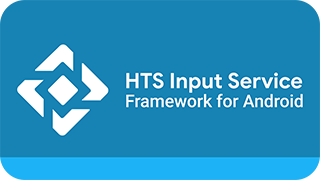

# HTS Input Service

<p align="center">
  
</p>

HTS Input Service is an extension for the Android TV Input Framework that allows you to receive and watch your TVheadend channels on Google Live Channels or Mochi Live TV. This extension is based on [kodi-pvr/pvr.hts](https://github.com/kodi-pvr/pvr.hts) addon. 


## Why?

I've been using Kodi to watch live TV for several years now, and while it works great, it always felt disconnected from the rest of the system.
The Live Channels app, on the other hand, is like having a digital satellite receiver made by Google, complete with its original Material Design and animations.

While it was abandoned several years ago, it's still available on the Google Play Store and is compatible with current Android TV systems.
Alternatively, there's Monchi Live TV, which is a fork of Google's Live Channels app. It's still supported and was updated just a few days ago.


## Features

- **Live TV** from Tvheadend via the HTSP protocol (H.264, HEVC, MPEG-2; AAC, AC-3, E-AC-3, MP2)
- **Seperated TV and Radio sources:** You can disable all Radio channels with just one click of a button
- **Channel list** synced automatically, with logos
- **Full EPG** in the system TV guide, including genres, season/episode info and images
- **Live updates:** channel and EPG changes on the server show up without a manual rescan
- **Audio and subtitle track selection**
- **Login support** (username/password) or anonymous access
- **Streaming profile** selection
- **Auto-reconnect** if the connection drops
- **Configurable EPG range** (1 Hour, 6 Hours, 12 Hours, 1 Day, 3 Days, 7 Days and 8 Days)
- **Fully working Timeshift** Pause the current programme, rewind and fast-forward.
- Works with the built-in Live Channels / TV app, so it fits into the normal Android TV experience

## Not available yet

- Recordings, timers and series recordings
- Channel groups (tags)
- Wake-on-LAN, CAM info

## Requirements

- Android TV / Google TV device
- Tvheadend server (HTSP port `9982`, HTTP port `9981` by default)
- A Tvheadend user with streaming and HTSP rights

## Setup

1. Install the APK and open the app.
2. Enter host, ports, username and password. The login is tested before saving.
3. Choose streaming profile and EPG options, then run the channel scan.
4. Open **Live Channels** and pick the Tvheadend input.

## Build

```bash
./gradlew :app:assembleDebug
```

## Credits & License

Based on [kodi-pvr/pvr.hts](https://github.com/kodi-pvr/pvr.hts) by the Kodi team and contributors (GPL-2.0-or-later). This port is released under **GPL-2.0-or-later** as well.

The settings panel and setup interface is based on [kiall/android-tvheadend](https://github.com/kiall/android-tvheadend)

Not affiliated with Tvheadend or Kodi.
